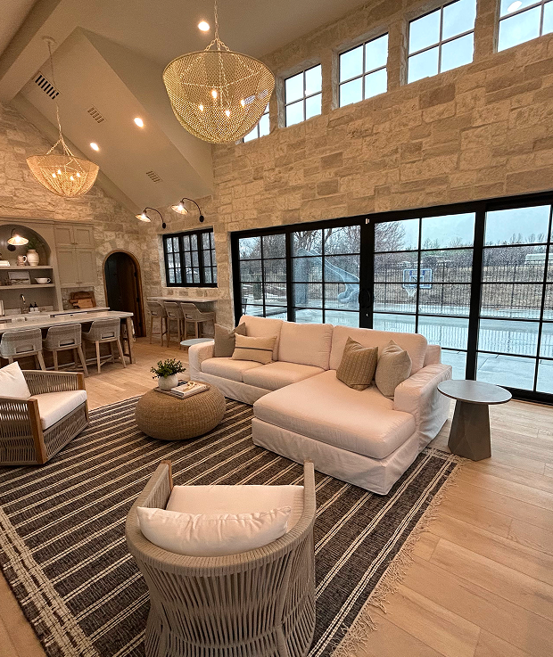

/* @import url("https://fonts.googleapis.com/css2?family=Inter:ital,opsz,wght@0,14..32,100..900;1,14..32,100..900&family=Open+Sans:ital,wght@0,300..800;1,300..800&family=Plus+Jakarta+Sans:ital,wght@0,200..800;1,200..800&display=swap"); */

:root {
  /* colors */
  --bg-brown: #daa14c;
  --bg-gray: #f5f5f5;
  --bg-black: #130a0d;
  --text-brown: #daa14c;
  --border-brown: #daa14c;
  --stroke-red: #daa14c;
  --text-white: white;
  --font-opensans: "Open Sans";
  --font-jakarta: "Plus Jakarta Sans";
  --font-inter: "Inter";
}

* {
  margin: 0;
  padding: 0;
  box-sizing: border-box;
  /* background: #000; */
  /* outline: 1px solid red; Temporary debugging */
}

html,
body {
  overflow-x: hidden;
}

.gx-11 {
  --bs-gutter-x: 11rem;
}

.section-padding {
  padding-top: 80px !important;
  padding-bottom: 72px !important;
}

/* a:hover {
  background-color: black !important;
  color: white !important;
} */

h1 {
  font-size: 48px;
  font-family: "Plus Jakarta Sans";
  font-weight: bold;
  line-height: 60px;
}

h2 {
  font-weight: bold;
  font-family: "Plus Jakarta Sans";
  font-size: 37px;
  line-height: 47px !important;
}

/* h2 span{
  color: var(--text-brown) !important;
} */

h3 {
  color: var(--text-brown) !important;
  font: "Plus Jakarta Sans";
  font-size: 24px;
}

h4 {
  /* padding-top: 24px !important;
  padding-top: 24px !important; */
  font-weight: bold;
  font-size: 1.5rem !important;
  font-family: "Plus Jakarta Sans";
  line-height: 32px;
}

p {
  font-family: "Open Sans";
  font-size: 18px;
  line-height: 30px;
}

.arrow {
  margin-bottom: 55px;
}

.cta-btn a {
  background-color: var(--bg-brown);
  color: white !important;
  display: inline-flex;
  align-items: center;
  justify-content: center;
  padding: 0.5rem 1rem;
  text-decoration: none;
  font-family: "Inter";
  margin-bottom: 5px;
}

/* section-portfolio */
.horizontal-line {
  width: 100%;
  height: 1px;
  background-color: var(--border-brown);
}

.section-portfolio {
  .img-wrapper {
    display: flex;
    flex-wrap: wrap;
    /* flex-direction: row;
    justify-content: space-around;
    align-items: center; */
    gap: 1rem;
  }

  .apart-content {
    display: flex;
    flex-direction: column;
    /* gap: 22rem; */
    height: 100%;
    justify-content: space-between;
    /* border: 1px solid var(--border-brown); */
  }

  .portfolio-details {
    display: flex;
    gap: 2rem;
    font-family: "Plus Jakarta Sans";
  }

  .content-wrappper {
    h2 {
      font-size: 24px;
      line-height: 32px;
    }
  }
}

/* resource-section */
.resource-section .content-wrapper {
  display: flex;
  flex-direction: column;
  /* justify-content: space-between; */
  padding: 1.5rem;
  gap: 7rem;
}

.process-box {
  background-color: white;
  padding: 3rem;

  .box-content {
    h4 {
      font-size: 24px;
      font-weight: bold;
      line-height: 32px;
      /* color: var(--text-brown); */
    }
  }
}

.box-number {
  font-size: 80px;
  font-weight: bold;
  line-height: 80px;
  font-family: "Plus Jakarta Sans";
  margin-bottom: 1rem;
  color: transparent;
  -webkit-text-stroke: 1px var(--stroke-red);
}

p {
  font-family: "Open Sans";
}

/* hero-section */
.hero-section {
  #a {
    margin-top: -4rem;
    padding-right: 4rem;
  }

  .slide-btn-wrapper {
    display: flex;
    flex-wrap: wrap;
    justify-content: center;
    align-items: center;
    gap: 3rem;

    .slider-btn {
      /* border-bottom border-3 border-brown d-flex gap-3 justify-content-center w-auto */
      border-bottom: 3px solid var(--border-brown);
      display: flex;
      gap: 3;
      justify-content: center;
      width: auto;
    }
  }

  .step {
    cursor: pointer;
    padding: 10px 20px;
    border-bottom: 3px solid transparent;
    transition: border-color 0.3s ease;
    font-weight: bold;
  }

  .step.active {
    border-bottom: 3px solid #ff6600;
    /* Use your highlight color */
    color: #ff6600;
  }

  .image-overlay-wrapper {
    position: relative;
  }

  .image-overlay-wrapper img:nth-of-type(2) {
    position: absolute;
    top: 26%;
    right: 70.6%;
    width: 372px;
  }

}

/* about-section */
.about-section {
  #heading {
    font-size: 30px;
  }

  .twenty {
    width: 150px;
    /* height: 50px; */
  }

  .img {
    width: 76px;
    /* height: 100px; */
  }

  .right-content-wrapper {
    margin-bottom: 80px;
  }

  .experience-box {
    margin-top: 1rem;
    position: relative;
    display: inline-flex;
    align-items: center;
    justify-content: center;
    padding: 20px 40px;
    margin-left: 3rem;
  }

  .experience-box::before {
    content: "";
    position: absolute;
    left: 0;
    width: 70px;
    border-left: 8px solid #d19a41;
    border-top: 8px solid #d19a41;
    border-bottom: 8px solid #d19a41;
    height: 164%;
    top: 50%;
    transform: translateY(-50%);
  }

  .experience-box::after {
    content: "";
    position: absolute;
    right: 0;
    width: 70px;
    border-right: 8px solid #d19a41;
    border-top: 8px solid #d19a41;
    border-bottom: 8px solid #d19a41;
    height: 164%;
    /* increased from 40% */
    top: 50%;
    transform: translateY(-50%);
  }

  .experience-number {
    font-size: 7rem;
    font-weight: bold;
    color: #d19a41;
    margin: 0 15px 0 0;
  }

  .experience-text {
    line-height: 1.2;
    font-size: 1.5rem;
  }
}

/* section-blog */
.section-blog {
  .left-img {
    display: flex;
    flex-wrap: wrap;
    flex-wrap: nowrap;
    gap: 0.5rem;
  }
}

.blog-wrapper {
  display: flex;
  flex-direction: column;
  flex-wrap: wrap;
  /* allows wrapping on small screens */
  /* gap: 4.5rem; */
}

.blog-wrapper .Blog-cont {
  display: flex;
  flex-direction: column;
  flex-wrap: wrap;
  gap: 87px;

  h4 {
    margin-bottom: 1rem;
  }

  span {
    margin-bottom: 1.5rem;
  }
}

.section-chooseus{
  margin-bottom: 5rem;
}

.first-blog,
.secound-blog {
  flex: 1 1 300px;
  /* responsive width: minimum 300px */
}

.blog-content {
  display: flex;
  flex-wrap: wrap;
  gap: 16px;

  .right-content {
    .Blog-content {}
  }
}

.right-content .Blog-cont {
  display: flex;
  flex-direction: column;

  /* gap: 8px; */
  h4 {
    margin-bottom: 1rem;
  }

  span {
    margin-bottom: 0.5rem;
  }
}

.right-content {
  display: flex;
  flex-direction: column;
  justify-content: space-between;
}

/* resource-section */
.resource-section {
  background-color: #130a0d;
  margin-top: 3rem;

  .container-xxl {
    padding-left: 0;
    margin-left: 0;
  }
}

.custom-container {
  display: flex;
  flex-wrap: wrap;
  align-items: start;
  margin-left: 0;
  margin-right: auto;
  transition: all 0.3s ease-in-out;
  /* max-width: ; */
}

.img-custom {
  img {
    max-width: 600px;
    height: auto;
    transition: all 0.3s ease-in-out;
    padding-bottom: 3rem;
  }
}

.service-section {
  .left-content-wrapper {
    h2 {
      margin-bottom: 29px;
    }

    p {
      margin-bottom: 73px;
    }
  }

  .image-wrappers {
    /* margin-top: 5rem; */
    gap: 1rem;
    display: flex;
    flex-wrap: wrap;
    justify-content: space-between;
  }

  .arrows {
    display: flex;
    flex-direction: column;
    justify-content: center;
    align-items: center;
  }

  .image-wrapper .arrows .arrow {
    border: 1px solid var(--border-brown);
    padding: 0.5rem 1rem;
  }

  .hidden-arrows {
    display: flex;
    flex-direction: column;
    justify-content: center;
    margin-right: 3rem;
  }
}

/* sectionblog */
.section-Blog {
  .blog-btn a {
    border-bottom: 1px solid brown;
    text-decoration: none;
    color: black;
    font-family: "Plus Jakarta Sans";
  }
}

.section-banner {
  background-color: var(--bg-black);
  color: var(--text-white);
}

.section6 {
  .banner {
    background-image: url("../imgs/bg-img.png");
    background-size: cover;
    background-position: center;
  }
}

.form {
  margin: 40px 0;
  padding: 10px 20px;
}

/* footer */
.footer-padding {
  padding-top: 1rem !important;
  padding-bottom: 1rem !important;
}

.logo {
  margin-bottom: 3rem;
}

.img-wrapper img {
  width: 50%;
}

.footer h5 {
  margin-bottom: 2rem;
  font-size: 24px;
  line-height: 24px;
  font-weight: 600;
  font-family: "Plus Jakarta Sans";
}

.footer ul {
  list-style: none;
  display: flex;
  flex-direction: column;
  gap: 1rem;
  padding: 0;
}

.footer ul li {
  font-family: "Inter";
}

.footer ul li a {
  text-decoration: none;
  color: black;
}

.quick-links {
  margin-bottom: 1rem;

  h3 {
    margin-bottom: 30px;
  }

  ul {
    li {
      margin-bottom: 10px;
    }
  }
}

.icons {
  a {
    text-decoration: none;
    color: var(--text-brown);
  }
}

.contact-info {
  p {
    margin-bottom: 1.25rem;
  }

  a {
    text-decoration: none;
    color: black;
  }
}

.services {
  h3 {
    margin-bottom: 20px;
  }

  ul {
    li {
      margin-bottom: 10px;
    }
  }
}

.text-highlight {
  color: #f5a623;
}

.section-container {
  position: relative;
  padding: 3rem 1rem;
}

.image-top {
  width: 650px;
  height: auto;
  z-index: 2;
  margin-top: 1rem;
}

.image-bottom {
  position: relative;
  width: 675px;
  /* border-radius: 8px; */
  z-index: 1;

  img {
    margin-left: -6.55rem;
  }
}

.content-box {
  z-index: 3;
  position: relative;
  background-color: white;
  padding: 2rem;
  border-radius: 8px;
}

.checklist li {
  margin-bottom: 10px;
}

.checklist li::before {
  border-radius: 50%;
  content: "\2714\FE0E";
  background-color: #d3982d !important;
  padding: 0 0.3rem 0 0.3rem;
  color: white !important;
  font-weight: bold;
  margin-right: 8px;
}

/* process-section */
.process-section {
  .process-box {
    height: 100%;
    background-color: white;
    padding: 3rem;
  }
}

.testimonial-content {
  background-color: #fff;
  padding: 1rem;
  /* same as p-4 in Bootstrap */
  border-radius: 0.25rem;
  /* same as .rounded */
  position: relative;
  max-width: 400px;
}

.testimonial-text {
  position: relative;
  margin-bottom: 1rem;
  /* font-size: 1.25rem; */
}

.rating {
  color: #ffc107;
  /* Bootstrap text-warning color */
  margin-bottom: 0.5rem;
  /* same as mb-2 */
  position: relative;
}

.author {
  display: flex;
  align-items: center;
  position: relative;
  z-index: 1;
}

.author-img {
  border-radius: 50%;
  /* same as rounded-circle */
  margin-right: 0.5rem;
  /* same as me-2 */
}

.author-name {
  font-family: "Jakarta", sans-serif;
  /* same as font-jakarta */
}

.decorative-quotes {
  position: relative;

  span {
    background-image: url(../imgs/Vector.png);
    background-size: cover;
    background-position: center;
    width: 66px;
    height: 51px;
    position: absolute;
    top: -16px;
    left: -20px;
    z-index: 0;
    /* height: 50px; */
  }
}

.main-text {
  p {
    z-index: 1;
  }
}

.rating {
  z-index: 1;
}

/* contact */
.highlight {
  color: #d3982d;
}

.contact-section {
  padding: 60px 0;
  margin: auto auto;
}

.image-wrapper {
  position: relative;

  img {
    width: 679px;
    height: auto;
    display: block;
    /* border-radius: 5px; */
  }
}

.contact-form-wrapper {
  position: absolute;
  top: 50%;
  right: 104px;
  transform: translateY(-50%);
  background-color: #fff;
  padding: 40px;
  width: 500px;
  max-width: 100%;

  border-left: none;
  box-shadow: 0 10px 30px rgba(0, 0, 0, 0.1);
  z-index: 10;
}

.contact-form-wrapper form input{
  padding-bottom: 1rem;
}

.contact-form-wrapper::before {
  border-top: 6px solid #d3982d;
  border-bottom: 6px solid #d3982d;
  width: 66%;
  height: 100%;
  content: "";
  position: absolute;
  top: 0;
  left: 34%;
  z-index: -1;
  border-right: 6px solid #d3982d;
}

.form-control {
  border: none;
  border-bottom: 1px solid #aaa;
  border-radius: 0;
  box-shadow: none;
}

.form-control:focus {
  box-shadow: none;
  border-color: #d3982d;
}

.submit-btn {
  background-color: #d3982d;
  color: white;
  border: none;
  padding: 10px 25px;
}

.hero-section {
  .content-wrapper {
    h1 {
      margin-bottom: 1.5rem;
    }
  }
}

/* responsive */

/* About */

@media (max-width: 425px) {
  /* #image{
        width: 100px !important;
    } */

  .section-padding {
    padding-bottom: 60px !important;
    padding-top: 60px !important;
  }

  /* h1,h2{
      font-size: 19px;
    } */

  .section-Blog {
    .blog-wrapper {
      gap: 0;
      margin-bottom: 1rem;
    }

    .img {
      margin: auto;
    }

    .Blog-cont{
      gap: 0;
    }
  }

  .image-bottom {
    margin-left: 0;

    img {
      width: 100%;
    }
  }

  h1 {
    font-size: 30px !important;
    line-height: 34px !important;
  }

  h2 {
    font-size: 25px !important;
    line-height: 30px !important;
  }

  p {
    font-size: 17px !important;
    line-height: 24px !important;
  }

  .section-portfolio {
    .apart-content {
      gap: 0 !important;
      height: auto;
      /* border: 1px solid var(--border-brown); */
    }

    .img-wrapper {
      flex-wrap: nowrap;
      gap: 10px;
    }

    .content {
      justify-content: flex-start !important;
    }
  }

  .process-section {
    h2 {
      font-size: 30px !important;
    }
  }

  .section-portfolio {

    .h2 {
      font-size: 30px !important;
    }
  }

  .section-banner {
    padding: 40px 0 !important;

    .right-content {
      h3 {

        margin-bottom: 15px;
      }

      h2 {
        font-size: 25px !important;
        margin-bottom: 18px;
      }
    }
  }

  .decorative-quotes {
    span {
      background-image: url(../imgs/Vector.png);
      background-size: cover;
      background-position: center;
      width: 43px;
      height: 33px;
      position: absolute;
      top: -13px;
      left: -20px;
      z-index: 0;
      /* height: 50px; */
    }
  }

  .section-chooseus {
    h2 {
      font-size: 25px !important;
      margin-bottom: 16px;
    }

    .image-top {
      width: 100%;
      height: auto;
      padding: 0 !important;
      margin-bottom: 1rem;
    }

    .image-bottom {
      width: 100%;
      height: auto;
      padding: 0 !important;

      img {
        margin-left: 0;
      }
    }

    .bottom-content-wrapper {
      padding: 0 !important;
    }
  }

  .hero-section {
    .img1 {
      position: relative;
    }

    #a {
      margin-top: 1rem;
      padding-right: 2rem;
    }

    .img2 {
      position: static;
      margin-left: 0 !important;
      margin: auto;
    }

    .image-overlay-wrapper {
      position: relative;
    }

    .image-overlay-wrapper img:nth-of-type(2) {
      position: static;
      margin-left: 0.55rem;
    }
  }

  .resource-section {
    #heading {
      font-size: 30px !important;
    }
  }

  .resource-section {
    .content-wrapper {
      gap: 0;
    }
  }

  .about-section {
    .cta-btn a {
      text-align: center;
    }

    .experience-box {
      margin-left: 0rem;
    }

    .experience-box p {
      font-size: 73px !important;
    }

    .experience-box::before {

      height: 127%;

    }

    .experience-box::after {
      height: 127%;
    }
  }

  .service-section {
    .image-wrappers {
      img {
        width: 220px;
      }
    }

    span:hover {
      color: #d3982d !important;
      cursor: pointer;
    }
  }

  .image-wrapper {
    position: static;
    /* Remove relative */

    img {
      width: 100%;
      padding: 1px;
    }
  }

  /* .section-chooseus {
    .image-top {
      width: 100%;
      height: auto;
      padding: 0 !important;
    }
    .image-bottom {
      width: 100%;
      height: auto;
      padding: 0 !important;
      img {
        margin-left: 0;
      }
    }

    .bottom-content-wrapper {
      padding: 0 !important;
    }
  } */
  .section-contact {

    h2 {
      margin-bottom: 1rem;
    }

    .contact-form-wrapper {
      position: static !important;
      transform: none;
      width: 100%;
      margin-top: 20px;
      border: 6px solid #d3982d;
      padding: 20px;

    }

    .contact-form-wrapper::before {
      position: static;
      display: none;
    }
  }

  /* resource-section */
  .resource-section {
    .img-custom {
      img {
        width: 100% !important;
      }
    }
  }

  .about-section {
    .right-content-wrapper {
      margin-bottom: 35px;
    }
  }
}

@media (min-width: 425px) and (max-width: 768px) {
  .section-padding {
    padding-bottom: 60px !important;
    padding-top: 60px !important;
  }

  .section-portfolio {
    .apart-content {
      gap: 0 !important;
      height: auto;
      /* border: 1px solid var(--border-brown); */
    }

    .img-wrapper {
      flex-wrap: nowrap;
      gap: 10px;
    }

    .content {
      justify-content: flex-start !important;
    }
  }

  .section-Blog {
    .blog-wrapper {
      gap: 0;
      margin-bottom: 1rem;
    }

    .Blog-cont{
      gap: 0;
    }

    .img {
      margin: auto;
    }

    .img img {}
  }

  .decorative-quotes {
    span {
      background-image: url(../imgs/Vector.png);
      background-size: cover;
      background-position: center;
      width: 43px;
      height: 33px;
      position: absolute;
      top: -13px;
      left: -20px;
      z-index: 0;
      /* height: 50px; */
    }
  }

  .contact-form-wrapper {
    position: static !important;
    transform: none;
    width: 100%;
    margin-top: 20px;
    border: 6px solid #d3982d;
  }

  .contact-form-wrapper::before {
    position: static;
    display: none;
  }

  .hero-section {
    .image-overlay-wrapper {
      position: relative;
    }

    .image-overlay-wrapper img:nth-of-type(2) {
      position: static;
      /* margin-left: 4rem; */
    }
  }

  .about-section {
    .twenty {
      width: 100px !important;
      /* height: 50px; */
    }
  }

  .resource-section {
    #heading {
      font-size: 30px !important;
    }
  }

  .service-section {
    .imgs {
      img {
        width: 220px;
      }
    }
  }

  /* section8 */
  .box-wrapper {
    .process-box {
      width: 100% !important;
    }
  }

  .section7 {
    .img-cont {
      img {
        max-width: 100% !important;
        height: auto !important;
      }
    }
  }

  .image-wrapper {
    position: static;
    /* Remove relative */

    img {
      width: 100%;
    }
  }

  .contact-form-wrapper {
    position: static !important;
    /* Remove absolute */
    transform: none;
    width: 100%;
    margin-top: 20px;
    border: 6px solid #d3982d;
    /* Add all borders on mobile */
  }

  .resource-section {

    /* margin-top: 20px; */
    .img-custom {
      img {
        max-width: 100% !important;
      }
    }

    .content-wrapper {
      gap: 0;
    }
  }

  .section-Testimonials {
    padding: 1rem;
  }

  .section-Blog {
    .blog-wrapper {
      gap: 0;
    }

    .Blog-cont{
      gap: 0;
    }
  }

  .section-chooseus {
    .image-top {
      width: 100%;
      height: auto;
      padding: 0 !important;
    }

    .image-bottom {
      width: 100%;
      height: auto;
      padding: 0 !important;

      img {
        margin-left: 0;
      }
    }
  }
}

/* Tablet */
@media (min-width: 768px) and (max-width: 992px) {
  h1 {
    font-size: 30px !important;
    line-height: 34px !important;
  }

  h2 {
    font-size: 25px !important;
    line-height: 30px !important;
  }

  p {
    font-size: 17px !important;
    line-height: 24px !important;
  }

  .section-portfolio {
    .apart-content {
      gap: 0 !important;
    }

  }

  .contact-form-wrapper {
    position: static !important;
    transform: none;
    width: 100%;
    margin-top: 20px;
    border: 6px solid #d3982d;
  }

  .contact-form-wrapper::before {
    position: static;
    display: none;
  }

  .service-section {
    .imgs {
      gap: 10px;
      justify-content: center;

      img {
        width: 300px;
      }
    }
  }

  .experience-box {
    p {
      font-size: 73px !important;
    }
  }

  .hero-section {
    .image-overlay-wrapper {
      position: relative;
    }

    .image-overlay-wrapper img:nth-of-type(2) {
      position: static;
      margin-left: 4rem;
    }
  }

  .image-wrapper {
    position: static;

    /* Remove relative */
    img {
      width: 100%;
    }
  }

  .section-portfolio {
    .image-wrapper {
      flex-wrap: nowrap;
    }

    .apart-content {
      height: auto;
    }
  }

  .contact-form-wrapper {
    position: static !important;
    /* Remove absolute */
    transform: none;
    width: 100%;
    margin-top: 20px;
    border: 6px solid #d3982d;
    /* Add all borders on mobile */
  }

  .img-custom {
    max-width: 100%;
    height: auto;
    transition: all 0.3s ease-in-out;
  }

  .image-wrappers {
    img {
      width: 220px !important;
    }
  }
}

@media (min-width: 992px) and (max-width: 1200px) {
  .contact-form-wrapper {
    position: static !important;
    transform: none;
    width: 100%;
    margin-top: 20px;
    border: 6px solid #d3982d;
  }

  .contact-form-wrapper::before {
    position: static;
    display: none;
  }

  .resource-section {
    #heading {
      font-size: 29px !important;
    }

    .content-wrapper {
      gap: 0;
    }
  }

  .img-custom {
    img {
      max-width: 514px;
      height: auto;
      transition: all 0.3s ease-in-out;
    }
  }

  .image-bottom {
    position: relative;
    width: 480px;
    /* border-radius: 8px; */
    z-index: 1;

    img {
      margin-left: 0;
    }
  }

  .image-overlay-wrapper {
    position: relative;
    max-width: 90% !important;
  }

  .image-overlay-wrapper img:nth-of-type(2) {
    position: absolute;
    top: 24%;
    right: 63.6%;
    width: 300px;
  }

  .hero-section {
    h1 {
      font-size: 40px;
    }

    p {
      font-size: 17px;
    }

    .image-overlay-wrapper {
      position: relative;
      max-width: 90% !important;
    }

    .image-overlay-wrapper img:nth-of-type(2) {
      position: absolute;
      top: 24%;
      right: 63.6%;
      width: 283px;
    }
  }

  .section-contact {
    .image-wrapper {
      img {
        width: 100%;
        height: auto;
        display: block;
        border-radius: 5px;
      }
    }
  }

  .contact-form-wrapper {
    right: -14px;
  }

  .contact-form-wrapper::before {
    width: 54%;

    left: 46%;
  }

  .service-section {
    .imgs {
      img {
        width: 300px;
      }
    }
  }

  .contact-form-wrapper {
    right: -14px;
  }

  #section-container {
    .image-top {
      margin-top: 3rem;
    }
  }

  .image-wrappers {
    img {
      width: 303px !important;
    }
  }

  .custom-container {
    flex-wrap: nowrap;
  }
}

@media (min-width: 1400px) {
  .image-bottom {
    img {
      margin-left: -1rem;
    }
  }

  .custom-container {
    margin-left: auto;
    margin-right: auto;
  }

  .contact-form-wrapper {
    position: absolute;
    top: 50%;
    right: 188px;
    transform: translateY(-50%);
    background-color: #fff;
    padding: 40px;
    width: 651px;
    max-width: 100%;
    /* border-top: 6px solid #d3982d;
border-right: 6px solid #d3982d;
border-bottom: 6px solid #d3982d; */
    border-left: none;
    box-shadow: 0 10px 30px rgba(0, 0, 0, 0.1);
    z-index: 10;
  }

  .contact-form-wrapper::before {
    border-top: 6px solid #d3982d;
    border-bottom: 6px solid #d3982d;
    width: 66%;
    height: 100%;
    content: "";
    position: absolute;
    top: 0;
    left: 34%;
    z-index: -1;
    border-right: 6px solid #d3982d;
  }

  .hero-section {
    .image-overlay-wrapper {
      img {
        max-width: 100%;
        height: auto;
      }
    }
  }
}

@media (min-width: 1024px) and (max-width: 1200px) {

  .hero-section {
    .row{
      gap: 5rem !important;
    }
    h1{
      font-size: 39px;
      line-height: 45px;
    }
    .image-overlay-wrapper img:nth-of-type(1) {
      width: 90%;
    }
    .image-overlay-wrapper img:nth-of-type(2){
      right: 64.6%;
    }
  }
  /* section-portfolio */
  .section-portfolio {
    .content {
      justify-content: start !important;
    }

    .apart-content .content-wrapper{
      p{
        font-size: 16px;
      }
    }

  }

  .section-chooseus {
    .image-bottom{
      img{
        margin-top: 2rem;
      }
    }
    .image-top{
      img{
        margin-top: 7rem;
      }
    }
    .bottom-content-wrapper{
      padding: 0 !important;
      margin-left: 2rem;
    }
    .image-top {
      width: 100% !important;
    }
  }

  .section-Blog{
    .blog-content{
      flex-wrap: nowrap;
    }
  }
}

.bg-brown {
  background-color: var(--bg-brown) !important;
}

.bg-gray {
  background-color: var(--bg-gray) !important;
}

.bg-bkack {
  background-color: var(--bg-black) !important;
}

.text-brown {
  color: var(--text-brown) !important;
}

.border-brown {
  border-bottom: 1px solid var(--border-brown) !important;
}

.outlined-text {
  color: transparent;
  -webkit-text-stroke: 1px var(--stroke-red);
  font-weight: bold;
  font-size: var(--font-size-90px);
}

.outlined-texts {
  color: transparent;
  -webkit-text-stroke: 1px var(--text-brown);
}

.butn:hover {
  border: 1px solid var(--border-brown) !important;
}

.font-opensans {
  font-family: var(--font-opensans);
}

.font-jakarta {
  font-family: var(--font-jakarta);
}

.font-inter {
  font-family: var(--font-inter);
}

.mb-6 {
  margin-bottom: 5rem;
}

@media (min-width: 960px) {
  .ms-t-6 {
    margin-top: var(--margin-top-9rem);
  }

  .section-chooseus {}
}

.fs-7 {
  font-size: var(--font-size-40px) !important;
}

@media (max-width: 425px) {
  .fs-sm-7 {
    font-size: var(--font-size-29px) !important;
  }
}

<!DOCTYPE html>
<html lang="en">

<head>
  <!-- Required meta tags -->
  <meta charset="utf-8" />
  <meta name="viewport" content="width=device-width, initial-scale=1, shrink-to-fit=no" />

  <!-- Bootstrap CSS -->
  <link href="https://cdn.jsdelivr.net/npm/bootstrap@5.3.0/dist/css/bootstrap.min.css" rel="stylesheet" />

  <link rel="stylesheet" href="CSS/style.css" />
  <link rel="stylesheet" href="CSS/utility.css" />
  <link rel="stylesheet" href="CSS/fonts.css" />

  <!-- font icon cdn -->
  <link rel="stylesheet" href="https://cdnjs.cloudflare.com/ajax/libs/font-awesome/7.0.0/css/all.min.css"
    integrity="sha512-DxV+EoADOkOygM4IR9yXP8Sb2qwgidEmeqAEmDKIOfPRQZOWbXCzLC6vjbZyy0vPisbH2SyW27+ddLVCN+OMzQ=="
    crossorigin="anonymous" referrerpolicy="no-referrer" />

  <title>CSV Project</title>
</head>

<body>
  <!-- Navbar -->
  <nav class="navbar navbar-expand-lg navbar-light bg-white">
    

      <!-- Logo -->
      

      <a class="navbar-toggler" type="a" data-bs-toggle="collapse" data-bs-target="#navbarSupportedContent"
        aria-controls="navbarSupportedContent" aria-expanded="false" aria-label="Toggle navigation">
        
      </a>

      <!-- Navbar Links and a -->
      

        <!-- Navigation Links -->
        <ul class="navbar-nav mx-auto mb-2 mb-lg-0 text-center font-opensans">
          <li class="nav-item">
            <a class="nav-link active" aria-current="page" href="#home">Home</a>
          </li>
          <li class="nav-item">
            <a class="nav-link" href="#services">
              Services
              <i class="fa-solid fa-chevron-down" style="font-size: 12px"></i>
            </a>
          </li>
          <li class="nav-item">
            <a class="nav-link" href="#about">About Us</a>
          </li>
          <li class="nav-item">
            <a class="nav-link" href="#portfolio">Portfolio</a>
          </li>
          <li class="nav-item">
            <a class="nav-link" href="#contact">Service Location</a>
          </li>
        </ul>

        

          <a href="#">
            <i class="fa-solid fa-phone-volume"></i>
            808-457-0060
          </a>
        

      

    

  </nav>

  <!-- Hero Section -->
  <main>
    <section class="hero-section">
      

        

          

            

              <h1>
                Create Your Dream
                Home With Our Custom
                Home Builders
              </h1>
              

                From blueprint to reality, our expert custom home
                builders design and craft personalized, high-quality
                
                homes tailored to your lifestyle, vision, and needs
              

              

                <a href="#" type="submit"> Explore Our Services </a>
              

            

          

          

            

              
              
            

          

        

        

          

            
01

            
02

            
03

          

        

      

    </section>

    <section class="about-section section-padding">
      

        

          <!-- Left Column -->
          

            

              <h3>About Us</h3>
              <h2 class="mb-4 mb-lg-5">
                Specializing inWhole Home
                Remodels, Home Renovation Services, and High-End Home
                Construction
              </h2>
              
            

          

          <!-- Right Column -->
          

            

              

                Do you want to make your house feel more like a home? Whether
                you are remodeling your current home, building a home
                addition, or embarking on a custom new construction, CHV
                Construction is here to bring your vision to life. We
                specialize in luxury home remodels and home construction
                services in Salt Lake County, Utah County, Sanpete County, and
                Juab County.
              

              

                <a href="#"> Schedule Your Free Estimate Today </a>
              

            

            <!-- Experience  -->
            

              
20

              

                Years Experience
                Working
              

            

          

        

      

    </section>

    <!-- resource-section comp-->
    <section class="resource-section">
      

        

          <!-- Image Section -->
          

            

              
            

          

          <!-- Text Content Section -->
          

            

              

                <h3>Resources</h3>
                <h2 class="text-white">
                  Download Our FREE Homeowner’s Guide to Remodeling
                </h2>
              

              

                

                  Discover expert tips, budgeting advice,
                  and design inspiration to make your
                  remodeling project seamless.
                

                

                  <a href="#"> Download Now </a>
                

              

            

          

        

      

    </section>

    <!-- service-section -->
    <section class="service-section section-padding">
      

        

          

            

              <h3>Our Services</h3>
              <h2>
                Our Luxury Home Construction
                Services
              </h2>

              

                <i class="fa-solid fa-arrow-left"></i>

                <i class="fa-solid fa-arrow-right"></i>
              

            

          

          

            

              

                Your home should be a space where you feel the most
                comfortable and relaxed. If it feels cramped or outdated, you
                may be missing that warmth and comfort of being at home. CHV
                Construction can help you feel more at home with home
                renovation services tailored to your needs and budget. Every
                project we take on is delivered with a collaborative approach,
                involving our clients through every step of the process.
              

            

          

        

        

          

            <i class="fa-solid fa-arrow-left"></i>
          

          
          
          

          

            <i class="fa-solid fa-arrow-right"></i>
          

        

      

    </section>

    <section class="section-chooseus bg-gray section-padding">
      

        

          

            

              <h3 class="mb-3">Why Choose Us</h3>
              <h2 class="mb-3">
                Why Choose CHV 
                Construction ?
              </h2>
              

                CHV Construction is not just another home remodeling company.
                Our firm was built on a foundation of 20 years of experience
                from our founder, Clint Hurst. Since 2018, we have been a
                trusted custom home builder in Utah, and we have a deep
                knowledge of Utah County housing trends and permitting
                processes. We also prioritize modern building techniques, and
                our team is constantly keeping up to date with construction
                innovations to make your project more efficient and affordable
                while delivering your aesthetic vision.
              

            

          

          

            

              
            

          

        

        

          

            

              
            

          

          

            

              <h3 class="mb-3">Collaboration</h3>
              <h2 class="mb-3">
                Designing Homes That Reflect
                Your Lifestyle
              </h2>
              

                When we visit your space to discuss a remodel—or when you
                visit us to discuss custom home construction—we will help you
                design a space that fits into your lifestyle, emphasizing flow
                and functionality throughout the home. We will also take the
                time to go over different materials, designs, and finishes to
                discuss why they may or may not work for your home.
              

              

                <ul class="list-unstyled checklist font-jakarta">
                  <li>Your Home, Your Vision</li>
                  <li>Empowered Collaboration</li>
                  <li>Personalized Remodels</li>
                </ul>
              

            

          

        

      

    </section>

    <!-- section-banner -->
    <section class="section-banner section-padding">
      

        

          <!-- right contnet -->
          

            

              <h3>React Out To Us</h3>
              <h2>Don’t Settle for a House That Doesn’t Feel Like Home</h2>
            

          

          <!-- left a -->
          

            

              <a href="#" class="text-center"> Schedule Your Free Estimate Today </a>
            

          

        

      

    </section>

    <!-- section-chooseus -->

    <section class="section-portfolio section-padding">
      

        

          

            

              <h3>Best Work</h3>

              <h2>Our Featured Projects</h2>
            

          

          

            

              

                

                  Explore our stunning, expertly crafted
                  projects showcasing quality and innovation.
                

              

              

                <a href="#"> View portfolio </a>
              

            

          

        

        

          

            

              

                <h4>Urban Chic Haven</h4>
                

                  A contemporary, stylish home featuring
                  clean lines, cozy interiors, and modern
                  
                  aesthetics.
                

              

              

                
2024

                
New York

                
Residential

              

            

          

          

            

              
              
            

          

        

        

        <!-- 
               -->
        

          

            

              

                <h4>Urban Chic Haven</h4>
                

                  A contemporary, stylish home featuring
                  clean lines, cozy interiors, and modern
                  
                  aesthetics.
                

              

              

                
2024

                
New York

                
Residential

              

            

          

          

            

              
              
            

          

        

      

    </section>

    <section class="process-section bg-gray section-padding ">
      

        

          

            <h3>Our Process</h3>
            <h2>
              3 Easy Steps To Get Our Services
            </h2>
          

          

            

              

                

                  01
                

                

                  <h4>We Visit You at Home</h4>
                  

                    Through a unique combination of engineering, construction
                    and design disciplines and expertise.
                  

                

              

            

            

              

                

                  02
                

                

                  <h4>Detailed Design Process</h4>
                  

                    Through a unique combination of engineering, construction
                    and design disciplines and expertise.
                  

                

              

            

            

              

                

                  03
                

                

                  <h4>Take Feedback & Repair</h4>
                  

                    Through a unique combination of engineering, construction
                    and design disciplines and expertise.
                  

                

              

            

          

        

      

    </section>

    <section class="section-Testimonials section-padding">
      

        

          

            

              <h3>Testimonials</h3>
              <h2>
                What Our Clients
                 Are Saying
              </h2>
            

          

          

            

              

                Homeowners and commercial property owners alike love working
                with us because we build long-term relationships with our
                clients, and we tailor every project to each client’s unique
                needs and budget. See the difference our approach makes by
                reading through some of our glowing reviews.
              

            

          

        

        

          <!-- Testimonial-1 -->
          

            

              <!-- Decorative Quote -->
              

                
              

              <!-- Main Text -->
              

                

                  From start to finish, the team truly listened to our vision
                  and brought it to life beautifully. We couldn’t be happier!
                

              

              <!-- Stars -->
              
★★★★★

              <!-- Author -->
              

                
                <strong class="author-name">Sarah M.</strong>
              

            

          

          

            

              <!-- Decorative Quote -->
              

                 
              

              

                

                  The attention to detail and personalized approach made our
                  dream home a reality. Truly outstanding craftsmanship.
                

              

              <!-- Stars -->
              
★★★★★

              <!-- Author -->
              

                
                <strong class="font-jakarta">Sarah M.</strong>
              

            

          

          

            

              <!-- Decorative Quote -->
              

                 
              

              

                <!-- Main Text -->
                

                  They made the entire process smooth and enjoyable, ensuring
                  we felt heard and involved every step of the way.
                

              

              <!-- Stars -->
              
★★★★★

              <!-- Author -->
              

                
                <strong class="font-jakarta">Sarah M.</strong>
              

            

          

        

      

    </section>

    <section class="section-Blog bg-gray section-padding">
      

        

          

            <h3>Blogs & Insights</h3>
            <h2>
              Our Latest Blogs & Insights
            </h2>
          

        

        
        

          

            

              

                

                

                  

                    <h4>
                      Creating Creating a Spa-Like Bathroom: Design Ideas and
                      Inspiration
                    </h4>
                    <i class="fa-solid fa-calendar"></i> 8 May,
                      2023
                    

                      Transform your bathroom into a serene retreat with calming
                      colors, natural textures, and luxurious fixtures that
                      create a peaceful, spa-inspired atmosphere.
                    

                  

                  

                    <a> Read More </a>
                  

                

              

            

          

          

            

              

                
                

                  

                    
                  

                  

                    

                      <h4>
                        The Power of Accent
                        Lighting in Interior Design
                      </h4>
                      <i class="fa-solid fa-calendar"></i> 8
                        May,
                        2023
                      

                        Elevate any room’s ambiance with
                        accent lighting — highlighting key ...,
                      

                    

                    

                      <a> Read More </a>
                    

                  

                

              

              

                

                  

                    
                  

                  

                    

                      <h4>
                        How to Choose the Right
                        Colors for Your Bedroom
                      </h4>
                      <i class="fa-solid fa-calendar"></i> 8 May,
                        2023
                      

                        Create your perfect bedroom sanctuary
                        
                          by selecting colors that promote relax..
                      

                    

                    

                      

                        <a> Read More </a>
                      

                    

                  

                

              

            

          

        

      

    </section>

    <!-- contact section comp -->

    <section class="section-contact section-padding">
      

        <!-- Top text -->
        

          <h3>Contact Us</h3>
          

            <h2>
              Let’s Start Your Dream
              Project Today
            </h2>
          

          

            

              Transform your home with expert guidance — schedule a free
              consultation to explore ideas, designs, and solutions tailored
              to your vision and lifestyle.
            

          

        

        

          

          

            <h2 class="mb-4">Get in Touch</h2>
            <form>
              

                

                  <input type="text" class="form-control" placeholder="Your Name" required />
                

                

                  <input type="email" class="form-control" placeholder="Your Email" required />
                

              

              

                

                  <input type="text" class="form-control " placeholder="Phone Number" required />
                

                

                  <input type="text" class="form-control" placeholder="Service Type" required />
                

              

              

                <textarea class="form-control" rows="3" placeholder="Description"></textarea>
              

              

                <a href="#" type="submit">Submit Request</a>
              

            </form>
          

        

      

    </section>
  </main>
  <!-- footer comp-->

  <footer class="footer bg-light py-5">
    

      

        <!-- Logo and Description -->
        

          

            

              
            

            

              Our kitchens may not whisk you away to sun-kissed foreign
              shores, but our collection boasts all the quality craftsmanship
              and style.
            

          

          <!-- Call Us Now -->
          

            

              <a href="tel:808-457-0060" class="text-decoration-none text-dark">
                <i class="fa-solid fa-phone-volume fs-4 text-brown"></i>
                808-457-0060
              </a>
            

            Call Us Now!
          

        

        <!-- Quick Links -->
        

          <h5>Quick Links</h5>
          <ul class="list-items">
            <li><a href="#">Home</a></li>
            <li><a href="#">About</a></li>
            <li><a href="#">Service</a></li>
            <li><a href="#">Portfolio</a></li>
            <li><a href="#">Contact Us</a></li>
          </ul>
        

        <!-- Services -->
        

          <h5>Services</h5>
          <ul class="list-items">
            <li><a href="#">Whole Home Remodel</a></li>
            <li><a href="#">Kitchen Remodel</a></li>
            <li><a href="#">Bathroom Remodel</a></li>
            <li><a href="#">Home Addition</a></li>
            <li><a href="#">Basement Services</a></li>
            <li><a href="#">Tenant Improvement</a></li>
            <li><a href="#">Custom Home Build</a></li>
          </ul>
        

        <!-- Contact Info & Socials -->
        

          

            <h5>Contact Us</h5>
            
135 West Mountain Way Dr. Orem, Utah 84058

            
<a href="#">clint@chvconstruction.com</a>

            
<a href="#">(385) 314-7180</a>

          

          

            <a href="#" class=""><i class="fa-brands fa-facebook"></i></a>
            <a href="#" class=""><i class="fa-brands fa-linkedin"></i></a>
            <a href="#" class=""><i class="fa-brands fa-instagram"></i></a>
            <a href="#" class=""><i class="fa-brands fa-youtube"></i></a>
          

        

      

      

      

        

          © 2025 CHV Construction. All Rights Reserved.
        

      

    

  </footer>

  
  
  
</body>

</html>